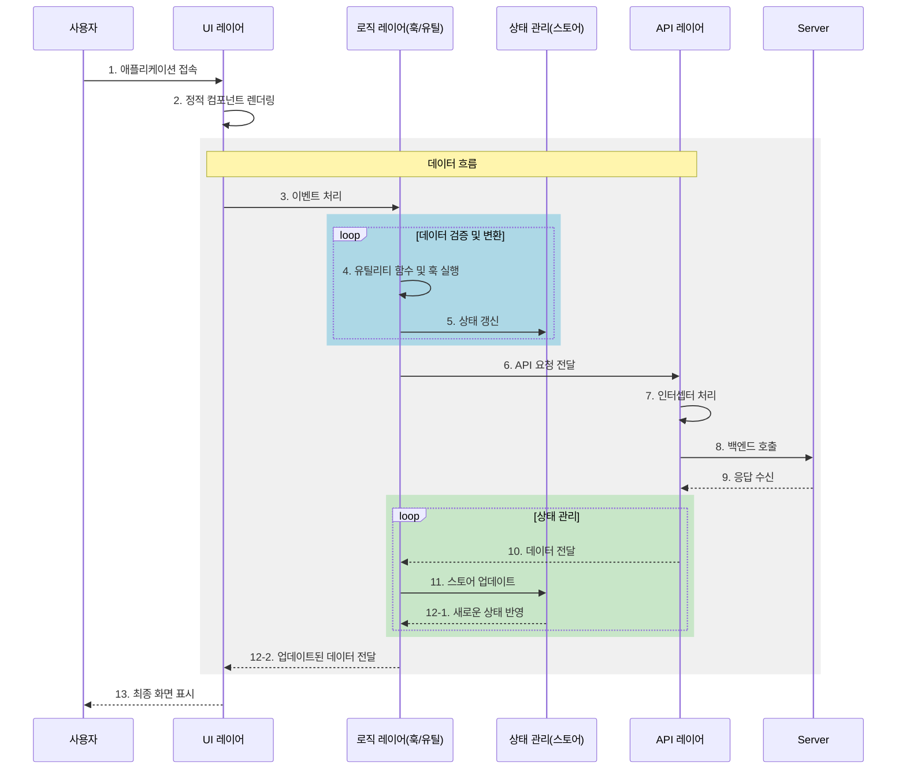

### **프로젝트 개요**

> **플랫폼:** `AI 기반 스마트 업무 관리 플랫폼`
> 
> 
> **주요 기능:** 회의 관리/분석, 업무 자동화, AI 어시스턴트 통합 솔루션
> 
> **타겟:** 협업이 필요한 팀 및 조직
> 
> **기술 스택:** `React, TypeScript, Tailwind CSS, Vite`
> 

---

### 프로젝트 팀 구성

> **개발팀:** 엘리스트랙 포트폴리오 1기 2차 프로젝트 2팀
> 
> 
> **Github:** https://github.com/chickengir1/ai-zy-front
> 
> **Demo:** https://kdt-pt-1-pj-2-team02.elicecoding.com/
> 
> **팀 멤버:**
> 
> • **프론트엔드:** 이강호
> 
> • **백엔드:** 안승우, 김연지, 이태정, 백승일
> 

---

### 프론트엔드 시퀀스 다이어그램

---

### 핵심 기능

### 회의 관리

- **실시간 회의록 자동 작성**
- **AI 기반 회의 내용 요약 및 분석**
- **회의 결과 기반 업무 자동 생성**

### 투두리스트

- **업무 우선순위 자동 분류**
- **태그 기반 업무 카테고리 분류**
- **진행 상태 시각화**
(일반, 기획, 디자인, 개발 등 **8개 분류**)

### 어시스턴트

- **자연어 명령어 인식**
(예: `@요약하기`, `#문서 아이디` && `@생성하기`, `#긴급`, `9시 업무 생성해줘`)
- **실시간 채팅 인터페이스 기반 상호작용**
- **업무 자동화 명령어 지원**
(긴급, 업무, 프로젝트 등 **5단계 우선순위**)

---

### 기술 스택

> **프론트엔드:** `React + TypeScript + Vite`
> 
> - **스타일링:** `Tailwind CSS` 기반 디자인 시스템
> - **라우팅:** 자체 개발 페이지 라우터 (`vite-plugin-pages-router`)
> - **API 연동:** Elice 서버 프록시 연동 (`/api` 경로)

---

### 주요 컴포넌트

### 멘션 기반 태그 기능

- **실시간 태그 인식 및 멘션 기능**을 통해 관련 업무 및 문서를 쉽게 연결
- 협업 중 중요한 키워드나 태그를 빠르게 검색하고 필터링 가능

### 오픈AI 문서요약

- **오픈AI 기술 활용:** 긴 문서 및 회의록을 자동 요약
- **핵심 포인트 제공**으로 업무 효율성 향상

### 투두리스트 생성

- **업무 우선순위에 따른 할 일 목록 생성**
- **태그 및 카테고리 기반 분류**로 체계적인 업무 관리 지원

### 일반적인 챗봇

- **자연어 명령어 인식 챗봇** 제공
- **업무 자동화 및 기본 문의 대응** 기능 구현

### 프로젝트 관리

- **프로젝트 개요 및 진행 상황 시각화**
- 팀원 간 **실시간 업데이트 및 협업 지원**

### 회의록 관리

- **회의 내용 자동 기록 및 저장**
- 작성된 회의록 **검색, 수정, 버전 관리** 기능 제공

### 일정관리

- **일정 등록, 수정, 알림 기능** 제공
- 팀원 간 **일정 공유 및 동기화**로 효율적인 시간 관리
